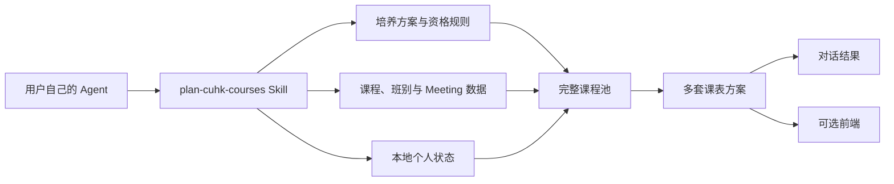

# CoursePlan

面向香港中文大学本科生的 Agent-first 选课规划工作台。

CoursePlan 把培养方案、学期课表、班别时间、先修条件和个人修课状态放进同一套可审计的数据流程。你可以直接让自己的 Codex、Claude Code 或其他支持 Skills 的 Agent 完成规划；网页只是一个可选的可视化界面，用来查看培养进度、完整课程池和多套周历方案。

它主要解决 CUSIS 查课步骤繁琐、加载缓慢、班别组合和时间冲突难以处理的问题：Agent 可以快速整理上千门课程信息，筛出符合毕业要求与个人偏好的组合，并排出理想课表。想比较方案时使用前端；不想打开前端，也可以完全在 Agent 对话中完成。


> 当前处于早期开发阶段。所有资格、余位、Consent、Reserved Quota 和学院审批结果，最终均以 CUSIS 与校方通知为准。

## 为什么做这个项目

传统选课工具通常只回答“课程什么时候上”，却很难同时回答：

- 这门课能否计入我的毕业要求？
- 我是否满足先修、专业、年级或书院限制？
- 哪些限制仍需向学院确认？
- 在学分上限内，怎样减少上课日并保留更多整天空闲？
- 如果某门课满座，还有哪些可解释、可比较的替代方案？

CoursePlan 将这些问题交给用户自己的 Agent 处理，并保留计算依据、不确定项和人工确认点。

## 核心能力

- 读取学生背景、修课记录、豁免／转学分、目标学期和学分上限。
- 根据尚未完成的毕业要求，为本学期完整开课集合排序，而不是只给一小份推荐清单。
- 将课程区分为 `eligible`、`needs confirmation` 和 `unavailable`，并解释先修不足、无余位、Consent、Reserved Quota 或学院审批等原因。
- 从真实 `Course → Class → Meeting` 数据生成无时间冲突的课表。
- 比较“最少上课日”“毕业进度与负担平衡”“学分上限内最大化”等多套方案。
- 可纯对话使用；需要时再打开前端查看培养进度、课程池和周历。

## 使用方式

项目内置通用 Skill：[`skills/plan-cuhk-courses`](skills/plan-cuhk-courses/SKILL.md)。在支持项目级 Skills 的 Agent 中打开本仓库，然后直接描述目标，例如：

```text
帮我规划下学期。优先满足毕业要求，不超过我的学分上限，
尽量把课程集中在三天，并解释所有需要学院批准的项目。
```

Agent 会：

1. 读取已有个人状态，只补问缺失信息；
2. 重建完整课程池并标记资格与不确定项；
3. 使用真实班别和 Meeting 数据生成多套方案；
4. 写回本地个人状态；
5. 汇总结果，并询问是否需要打开前端。

前端不是必需步骤，也不包含独立的内置聊天 Agent。

## 工作原理



项目坚持三个边界：

- Agent 负责自然语言理解、解释和规划；
- 数据与脚本负责确定性计算和可追溯结果；
- 前端只负责渲染，不把后台计算伪装成用户必须完成的流程。

## 数据与可信度

公共数据主要位于：

- `data/cuhk-timetable/`：学期课程、班别、Meeting、余位和抓取快照；
- `data/cuhk/`：培养方案原始证据与清洗结果；
- `data/curriculum/`：培养要求、先修关系、资格规则及待核验项；
- `data/sources/`：官方来源登记；
- `tools/` 与 `scripts/`：导出、清洗、校验、课程池和排课相关脚本。

数据不会因为规则缺失而把课程静默删除。无法可靠判断的课程会保留在 `needs confirmation`，并说明需要核实的事项。

## 隐私

个人档案、修课记录和生成的课表方案只保存在本地，并已由 `.gitignore` 排除：

- `data/student/`
- 个人培养计划来源副本
- 含本机路径或个人统计的 manifest
- 本地生成、缓存和运行时文件

公开仓库前仍应执行一次敏感信息检查。不要提交 CUSIS Cookie、OnePass 信息、API Key、个人截图或未经脱敏的修课记录。

## 本地运行

要求 Node.js 22.13 或更高版本。

```bash
npm install
npm run dev
```

默认访问 [http://localhost:3000](http://localhost:3000)。

常用命令：

```bash
npm run build          # 构建前端
npm test               # 构建并运行页面测试
npm run lint           # 静态检查
npm run data:validate  # 校验数据资产
```

## 项目结构

```text
CoursePlan/
├── app/                         # 可选的前端渲染层
├── data/                        # 公共课程、培养方案与本地个人状态
├── scripts/                     # 课程池与数据处理脚本
├── skills/plan-cuhk-courses/    # 跨 Agent 的选课工作流
├── tools/                       # CUSIS 导出、快照与校验工具
├── tests/                       # 构建和行为检查
└── docs/                        # 产品、数据模型与审计文档
```

更详细的数据读取顺序见 [`docs/11-project-structure.md`](docs/11-project-structure.md)。

## 当前状态

已经具备：

- Term 1/2 课程与班别数据资产；
- 培养方案与课程规则的结构化数据；
- 完整课程池生成与资格分组；
- 项目级 `plan-cuhk-courses` Skill；
- 基于真实 Meeting 数据的课表方案数据结构；
- 可选前端及基础构建测试。

仍在完善：

- 更完整的先修、互斥、重复计分和审批规则；
- 通用、脱敏的前端初始化状态；
- 稳定的排课优化器与方案比较；
- 多学期数据更新和质量报告自动化；
- 面向更多培养方案的端到端验证。

## 贡献

欢迎提交数据修正、规则证据、解析器改进和测试。涉及课程资格的修改，请同时注明官方来源、适用学期以及仍无法确认的边界。

## 免责声明

CoursePlan 是辅助规划工具，不代表香港中文大学，也不能替代 CUSIS、院系审批、书院规定或教务处的正式决定。注册前请再次核对最新官方信息。
